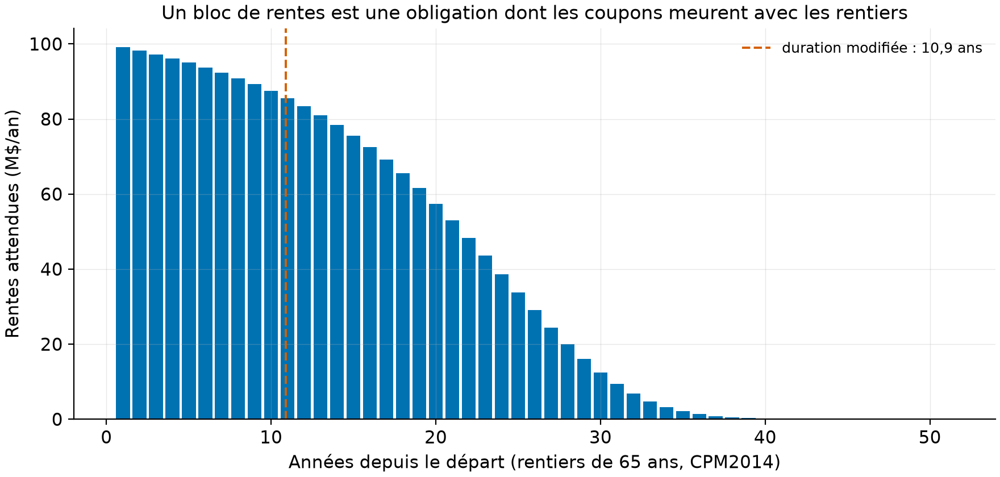
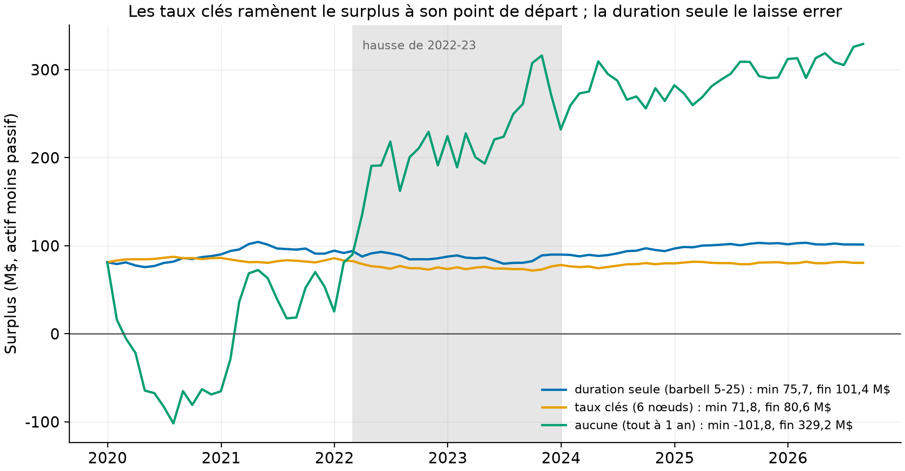
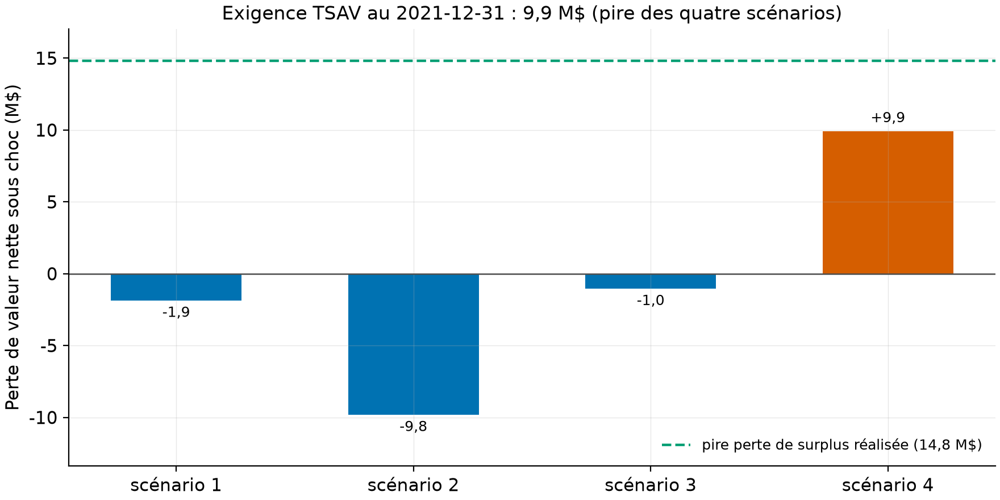

# L'immunisation à l'épreuve de 2022, et le capital TSAV à l'épreuve du réalisé

Un bloc de rentes viagères (mortalité CPM2014), trois stratégies d'adossement sur les
courbes zéro-coupon réelles de 2019 à 2026, et le module de risque de taux du TSAV 2025
recalculé à la lettre depuis la ligne directrice de l'OSFI. *English summary below.*

## En bref

1. **À taux plancher, les chocs prescrits du TSAV étaient petits, et 2022 les a enfoncés.**
   Les chocs du chapitre 5 sont des fonctions de la RACINE CARRÉE des taux courants : fin
   2021, avec un 90 jours sous 0,5 %, le scénario le plus dur ne prescrivait que +147 pb au
   court terme ; 2022-23 en a livré plus de 400. Résultat mesuré : l'exigence calculée au
   2021-12 (9,9 M$, pire scénario : la pentification) n'a couvert que 67 % de la perte de
   surplus ensuite réalisée par le livre apparié en duration (14,8 M$). (Mesuré ; formules
   rapportées de la ligne directrice, section 5.1.2.1.)
2. **Redington tient exactement là où son théorème s'applique, et pas un pas plus loin.**
   Duration appariée ET convexité d'actif supérieure : aucun choc parallèle ne peut
   entamer le surplus (testé en forme fermée sur un barbell large). Mais le barbell 5-25
   du banc viole la condition de convexité face à un passif à queue de 50 ans (testé), et
   le théorème ne dit de toute façon rien des déformations de pente, qui ont fait
   l'essentiel de 2020-2026. (Mesuré et testé.)
3. **Le banc de 81 mois départage les trois stratégies sans appel.** L'appariement par
   taux clés ramène le surplus à son point de départ (81,3 puis 80,6 M$, à travers la
   tempête) ; la duration seule le laisse errer (de 75,7 à 101,4 M$, l'arrivée haute est
   une chance de trajectoire, pas un mérite) ; l'absence de couverture le fait passer par
   l'INSOLVABILITÉ (-101,8 M$ en juillet 2020) avant de finir à +329 M$ : les deux queues
   du même risque non couvert. (Mesuré.)

## La question

L'immunisation par la durée promet un surplus insensible aux taux, et le TSAV, le test de
capital des assureurs vie canadiens, tarifie le risque de taux par quatre scénarios
prescrits. Or entre 2020 et 2023 la courbe canadienne ne s'est pas déplacée : elle s'est
TORDUE, l'écart 10 ans moins 3 mois passant de +195 à -204 pb. Que reste-t-il de la
promesse de l'immunisation, et le capital prescrit couvrait-il la perte réellement subie ?

## Les données (100 % libres, téléchargées par script, jamais commitées)

| Source | Contenu | Usage | Statut |
|---|---|---|---|
| Banque du Canada, courbe zéro-coupon | 120 maturités quotidiennes, convertie en composition annuelle | valorisation et banc mensuel 2019-12 à 2026-08 | mesuré |
| ICA, table CPM2014 | mortalité des retraités canadiens, générationnelle 1999-2013 (CPM-B incorporée) | colonne 2013 en table STATIQUE (précepte déclaré) | mesuré |
| OSFI, TSAV 2025, chapitre 5 | formules des scénarios de taux (5.1.1-5.1.2.3) | recopiées à la lettre du PDF officiel | rapporté |

Le passif : 10 000 rentiers de 65 ans (hommes, déclaré), rente de 10 000 $ en fin d'année,
bloc fermé, non participant, sans rachat. Au 2019-12 : valeur actualisée de 1 625,5 M$ pour
2 018 M$ de rentes attendues, duration modifiée de 10,88 ans, convexité de 182 (mesuré,
`results/tables/passif.csv`). La mortalité réalisée égale l'attendue : le laboratoire
isole le risque de TAUX, déclaré.



**Comment lire cette figure.** Les rentes attendues année par année : un bloc de rentes
est une obligation dont les coupons meurent avec les rentiers, d'où cette décrue régulière
sur cinquante ans et une duration proche de onze ans, hors de portée de la plupart des
obligations simples.

## Volet 1 : le module de taux du TSAV, à la lettre

La structure initiale (section 5.1.1, rapporté) : taux comptant publiés jusqu'à 20 ans,
interpolation linéaire du taux vers le taux ultime (UIR, 4,5 % pour le Canada) entre 20 et
70 ans, UIR au-delà. Les quatre scénarios (5.1.2.1) déforment cette structure par des
chocs au 90 jours (T ou S) et au 20 ans (B ou C), fonctions linéaires de la racine carrée
des taux planchers à 0,5 % :

```
T± = 0,0049 ± 0,139 rac(max(r_0,25 ; 0,005))      S± = 0,0039 ± 0,111 rac(...)
B± = 0,0028 ± 0,102 rac(max(r_20  ; 0,005))       C± = 0,0023 ± 0,007 rac(...)
```

avec interpolation linéaire des coefficients entre 0,25 et 20 ans (les polynômes en t de
la ligne directrice, recopiés), UIR choqué de ± 40 pb, aucun plancher à zéro. Scénario 1 :
tout baisse ; 2 : le court monte, le long à peine (aplatissement) ; 3 : tout monte ; 4 :
le court baisse, le long monte (pentification). L'exigence non participante est la pire
baisse de valeur nette parmi les quatre, plancher à zéro, sans lissage (5.1.2.2-5.1.2.3).
Le test `test_licat_shock_hand_values` refait les chocs à la main : à 4 %, T+ = 0,0049 +
0,139 x 0,2 = +327 pb, exactement.

## Volet 2 : Redington, la promesse exacte et ses bords

Le théorème de Redington (1952) : valeur appariée, duration appariée, convexité d'actif
au moins égale, alors un PETIT déplacement PARALLÈLE ne peut pas réduire le surplus. Le
test `test_redington_wide_barbell_survives_parallel_shocks` le vérifie en forme fermée :
un barbell 2-30 ans satisfait les deux conditions et ne perd sous aucun choc parallèle de
± 100 pb. Mais le barbell 5-25 du banc, duration appariée, a MOINS de convexité que le
passif à queue de cinquante ans (testé : la condition du théorème est violée), et surtout
le théorème ne couvre ni les grands chocs ni les déformations : tout ce qui a compté
entre 2020 et 2023.

## Volet 3 : le banc de surplus (mesuré, `results/tables/surplus_mensuel.csv`)

Chaque fin de mois de 2019-12 à 2026-08 (81 courbes réelles), trois livres autofinancés
partent avec 5 % de surplus (précepte) et se rebalancent : « duration seule » (barbell de
zéro-coupon 5 et 25 ans appariant valeur et duration), « taux clés » (six zéro-coupon aux
nœuds 1-30 ans, chaque flux du passif réparti sur ses deux nœuds voisins en valeur
actualisée), « aucune » (tout à un an). Les rentes échues sont payées de l'actif ; aucun
apport extérieur.



**Comment lire cette figure.** Le surplus (actif moins passif) mois par mois. La courbe
jaune (taux clés) traverse la baisse de 2020 ET la hausse de 2022-23 (bande grise) pour
finir où elle a commencé : c'est la définition opérationnelle d'une immunisation. La
bleue (duration seule) finit 20 M$ plus haut qu'au départ : la déformation de la courbe
lui a été favorable CETTE FOIS ; son errance (fourchette de 26 M$) est le prix de
l'appariement grossier. La verte (aucune couverture) plonge à -101,8 M$ en juillet 2020,
l'insolvabilité, puis finit à +329 M$ quand les taux montent : le même pari nu, gagné ou
perdu selon l'année.

Le creux résiduel du livre par taux clés (-9,5 M$ au pic des taux longs, septembre 2023)
vient pour l'essentiel du coin réglementaire : au-delà de 20 ans le passif s'actualise en
partie vers un UIR FIXE à 4,5 % pendant que les zéro-coupon de 30 ans sont au prix du
marché ; l'écart se referme quand la courbe se normalise (mesuré sur la trajectoire ;
décomposition exacte non isolée, déclaré).

## Volet 4 : l'exigence prescrite contre la perte réalisée

Au 2021-12, la veille du choc, l'exigence du module (livre duration, périmètre non
participant statique) vaut (mesuré, `results/tables/exigence_licat.csv`) :

| Scénario | Perte de valeur nette |
|---|---|
| 1 (tout baisse) | -1,9 M$ (gain) |
| 2 (aplatissement) | -9,8 M$ (gain) |
| 3 (tout monte) | -1,0 M$ (gain) |
| **4 (pentification)** | **+9,9 M$ = l'exigence** |
| Pire perte de surplus réalisée après cette date | **14,8 M$** |



**Comment lire cette figure.** Les quatre barres sont les pertes prescrites ; seule la
pentification (scénario 4) mord un livre apparié en duration, et elle fixe l'exigence à
9,9 M$. La ligne verte est la perte réellement subie ensuite : 14,8 M$, une couverture de
67 %. La cause est dans la formule : à un 90 jours sous 0,5 % fin 2021, les chocs en
racine carrée prescrivaient +147 pb au court terme ; la réalité en a livré plus de 400.
Le même mécanisme qui adoucit l'exigence à taux bas (et l'alourdit à taux hauts) fait
qu'un choc historique partant du plancher passe au travers. (Mesuré ; le livre par taux
clés a subi 14,0 M$, couverture semblable.)

## Reproduire

```bash
uv sync --locked --all-extras
uv run pytest        # 14 tests fermés, sans réseau
uv run lic fetch     # courbe BdC (~17 Mo) + CPM2014 (ICA, 72 Ko)
uv run lic lab       # passif, trois bancs, exigence TSAV, trois figures (~1 min)
```

Les tests : structure initiale du TSAV (mi-chemin vers l'UIR à 45 ans, UIR à 70+),
duration d'un zéro-coupon en forme fermée t/(1+r), rente à mortalité constante contre la
série géométrique, chocs du chapitre 5 à la main (327 pb à 4 %), plancher de la racine à
0,5 %, UIR ± 40 pb, exigence nulle pour un livre parfaitement adossé, théorème de
Redington en forme fermée ET sa violation par le barbell serré, appariements exacts en
valeur et duration.

## Limites, avec statut

1. **Le périmètre est le module de taux, statique, non participant.** Pas de lissage sur
   six trimestres (réservé aux blocs participants), pas de fonds distincts, pas de
   composantes de crédit ni d'écart (sections 5.1.3 et suivantes), pas d'agrégation avec
   les autres risques du TSAV : le chiffre de 9,9 M$ est le requis brut du scénario, pas
   un ratio réglementaire. (Déclaré.)
2. **La valorisation suit la structure du TSAV partout**, y compris pour le surplus
   « économique » du banc : l'UIR fixe au-delà de 20-70 ans est une convention
   réglementaire, et le coin qu'il crée est discuté au volet 3. Une valorisation purement
   de marché au long bout donnerait des chemins voisins mais pas identiques. (Déclaré.)
3. **La mortalité est figée** (réalisée = attendue, table 2013 statique, hommes) : ni
   risque de longévité, ni amélioration au-delà de 2013 (ce qui sous-estime un peu la
   duration du passif). (Précepte déclaré.)
4. **Aucun frais, aucune prime, bloc fermé** : le banc isole la mécanique de taux.
   (Déclaré.)
5. **Le pire scénario dépend du livre.** La pentification mord NOTRE barbell ; un livre
   long en actif court aurait un autre pire scénario. Le constat de couverture (67 %)
   vaut pour ce bloc et cette période, pas en général. (Déclaré.)

## Références

- OSFI, *Test de suffisance du capital des sociétés d'assurance vie (TSAV/LICAT) 2025*,
  chapitre 5, sections 5.1.1 à 5.1.2.3 (PDF officiel ; formules recopiées à la lettre).
- Redington, F. M. (1952), « Review of the principles of life-office valuations »,
  *Journal of the Institute of Actuaries* 78(3).
- Institut canadien des actuaires (2014), table CPM2014 et échelle CPM-B (classeur
  public, jamais commité).
- Bolder, D. J., G. Johnson et A. Metzler (2004), « An empirical analysis of the Canadian
  term structure of zero-coupon interest rates », Banque du Canada, WP 2004-48.

## English summary

A closed block of 10,000 male-65 life annuities (CIA CPM2014 mortality, 2013 static
column, declared) is backed by three self-financing books rebalanced monthly on real Bank
of Canada zero-coupon curves, Dec-2019 to Aug-2026: duration-matched barbell (5y/25y),
key-rate matched (six zero-coupon nodes), and no hedge (all 1-year). Measured: the
key-rate book ends where it started (81.3 to 80.6 M$) through a curve that TWISTED by
400 bp; the duration-only book wanders (75.7 to 101.4 M$, the happy ending is path luck,
and its convexity VIOLATES Redington's condition against a 50-year-tail liability,
tested); the unhedged book goes insolvent (-101.8 M$ in July 2020) before ending at
+329 M$. Redington's theorem itself is verified in closed form where it applies (wide
barbell, parallel shocks). The LICAT 2025 chapter-5 interest rate module is
re-implemented to the letter from OSFI's official PDF: shocks are linear in the SQUARE
ROOT of current rates (T+ at 4 % = +327 bp, hand-tested), four prescribed scenarios,
UIR 4.5 % shocked by 40 bp, worst-scenario requirement floored at zero. Verdict: computed
on Dec-2021 (90-day rate below 0.5 %, so the prescribed short shock was only +147 bp),
the requirement was 9.9 M$ (binding scenario: the steepener) while the realized surplus
loss through 2022-23 was 14.8 M$: 67 % coverage. Free data only, 14 closed-form tests.

## Licence et citation

Code sous licence MIT ; rapport et figures CC BY 4.0. Données : Banque du Canada
(attribution), ICA (classeur public cité, jamais redistribué), OSFI (ligne directrice
citée). Citer via `CITATION.cff`.
